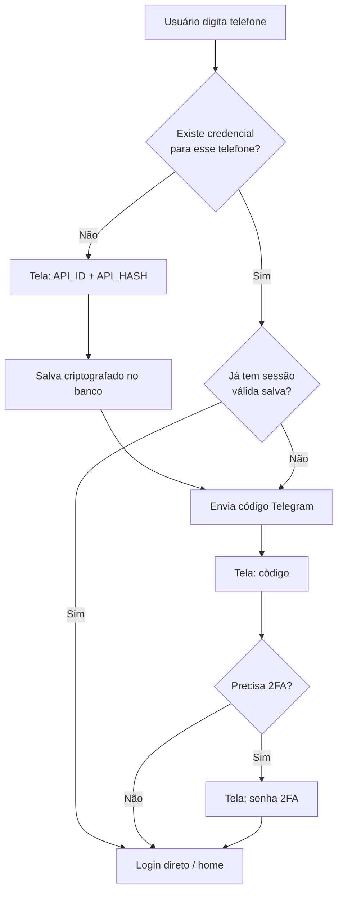

# Plano: credenciais Telegram por telefone (runtime + banco seguro)

> Documento de planejamento para implementação futura.  
> Status: **não implementado**

## Contexto atual vs. proposta

| Hoje | Proposta |
|------|----------|
| `API_ID` / `API_HASH` globais no `.env` | Credenciais **por número de telefone** |
| Sessão GramJS em arquivo (`session.txt`) | Sessão **por telefone** no banco |
| App pensado como **single-user** | Modelo **multi-tenant leve** (telefone = chave) |
| Rodando local | Deploy no **Render** (e talvez Netlify só pro frontend) |

A ideia faz sentido, mas exige mudanças estruturais no backend — não é só trocar o login.

---

## 1. Onde hospedar

### Render — backend

O GramJS precisa de:

- processo Node **persistente** (conexão MTProto com Telegram)
- streaming com `Range` (conexões longas)
- estado de login pendente (código, 2FA)

Combina com **Render Web Service** + **PostgreSQL**.

### Netlify — só frontend (recomendado)

Netlify Functions **não serve** bem para:

- GramJS / WebSocket persistente
- streaming de vídeo grande
- sessão Telegram ativa

**Arquitetura sugerida:**

```
Netlify  → React (client estático)
Render   → Express + GramJS + Postgres
```

Alternativa mais simples: **tudo no Render** (frontend + API no mesmo serviço).

---

## 2. Fluxo de login proposto



**Steps no frontend:**

1. **Telefone** — chave do usuário (`+5511...`)
2. **Credenciais** (só se não existir no banco) — `API_ID` + `API_HASH`
3. **Código** — como hoje
4. **2FA** — como hoje (se necessário)

---

## 3. Modelo de dados (PostgreSQL)

```sql
-- Credenciais Telegram por telefone
telegram_credentials (
  phone           TEXT PRIMARY KEY,      -- E.164: +5511999999999
  api_id          INTEGER NOT NULL,
  api_hash_enc    TEXT NOT NULL,         -- criptografado (nunca plaintext)
  api_hash_iv     TEXT NOT NULL,
  api_hash_tag    TEXT NOT NULL,
  created_at      TIMESTAMPTZ,
  updated_at      TIMESTAMPTZ
)

-- Sessão GramJS por telefone
telegram_sessions (
  phone           TEXT PRIMARY KEY,
  session_enc     TEXT NOT NULL,         -- StringSession criptografada
  session_iv      TEXT NOT NULL,
  session_tag     TEXT NOT NULL,
  updated_at      TIMESTAMPTZ
)

-- Estado temporário de login (código pendente, 2FA)
auth_pending (
  phone           TEXT PRIMARY KEY,
  phone_code_hash TEXT NOT NULL,
  step            TEXT NOT NULL,         -- 'code' | 'password'
  expires_at      TIMESTAMPTZ            -- ex.: 10 min
)

-- Progresso (migrar do JSON atual)
watch_progress (
  phone           TEXT,
  chat_id         TEXT,
  message_id      TEXT,
  watched         BOOLEAN,
  PRIMARY KEY (phone, chat_id, message_id)
)
```

**Por que separar credencial de sessão?**

- Credencial = app do my.telegram.org (raramente muda)
- Sessão = login ativo no Telegram (muda após logout / expiração)

---

## 4. Segurança das credenciais sensíveis

### O que fica no `.env` do Render (único segredo da infra)

```env
DATABASE_URL=postgres://...
ENCRYPTION_KEY=<32 bytes base64>   # chave mestra — NUNCA no banco
NODE_ENV=production
CLIENT_ORIGIN=https://seu-app.netlify.app
```

### Criptografia em repouso

- **`API_HASH`** e **`StringSession`** → AES-256-GCM antes de salvar
- Chave derivada de `ENCRYPTION_KEY` (única coisa sensível no ambiente)
- **`API_ID`** pode ficar em plaintext (é semi-público), mas também dá para criptografar por consistência

### Regras no backend

| Regra | Motivo |
|-------|--------|
| Nunca devolver `API_HASH` ao client | Mesmo após salvar |
| `API_HASH` só em input type password | UX |
| HTTPS obrigatório em produção | Render já fornece |
| Rate limit em `/auth/*` | Anti brute-force |
| `auth_pending` com TTL curto (~10 min) | Evita estado órfão |
| Validar credencial antes de salvar | Tentar `sendCode` e só persistir se OK |
| Logs sem credenciais/sessão | Nunca logar hash ou session string |

### O que **não** fazer

- Salvar credenciais no `localStorage` do browser
- Criptografar com chave hardcoded no código
- Confiar só em "obscurecer" no banco sem criptografia
- Usar SQLite/arquivo no Render free tier (disco efêmero — dados somem no redeploy)

---

## 5. Mudanças no backend

### Hoje

- 1 client GramJS global (`let client`)
- 1 `pendingAuth` em memória
- Credenciais de `env.apiId` / `env.apiHash`

### Depois

- **Client pool por telefone** (ou recriar on-demand):

  ```ts
  Map<phone, { client, lastUsed }>
  ```

- **`pendingAuth` no Postgres** (sobrevive restart do servidor)
- **`getCredentials(phone)`** → descriptografa do banco
- Todas as rotas autenticadas carregam o `phone` da sessão JWT/cookie

### Identificar usuário logado

| Opção | Prós | Contras |
|-------|------|---------|
| **Cookie httpOnly** com `phone` + session token | Simples, seguro | Precisa CORS/cookie config |
| **JWT** no header | Stateless | Precisa refresh, phone no payload |

**Recomendação:** cookie httpOnly + session ID apontando para `telegram_sessions.phone`.

---

## 6. Novos endpoints

```
POST /api/auth/lookup       { phone }                    → { hasCredentials, hasSession }
POST /api/auth/credentials  { phone, apiId, apiHash }    → salva + valida
POST /api/auth/start        { phone }                    → usa credencial do banco
POST /api/auth/verify       { phone, code?, password? }
GET  /api/auth/status                                    → usuário da sessão atual
POST /api/auth/logout
```

Todas as rotas de mídia (`/dialogs`, `/stream`, etc.) passam a exigir sessão ativa e usam o `phone` da sessão para pegar client + credencial corretos.

---

## 7. Frontend (LoginPage)

Steps condicionais:

```
phone → [credentials?] → code → [password?] → home
```

Tela de credenciais:

- Link para https://my.telegram.org
- Campos: `API ID` (number) + `API Hash` (password)
- Botão "Salvar e continuar"
- Texto explicando que fica criptografado no servidor

---

## 8. Impacto no app atual

| Área | Mudança |
|------|---------|
| `server/src/services/session-store.ts` | Migrar para Postgres |
| `server/src/services/progress-store.ts` | Migrar para Postgres (scoped por phone) |
| `server/src/services/telegram.ts` | Multi-tenant por phone |
| `server/src/config/env.ts` | Remove `API_ID`/`API_HASH`; adiciona `DATABASE_URL`, `ENCRYPTION_KEY` |
| Deploy | Render + Postgres; frontend separado ou junto |

---

## 9. Fases de implementação sugeridas

### Fase 1 — Infra

- Postgres no Render
- Migrations (Drizzle ou Prisma)
- Serviço de criptografia (`encrypt` / `decrypt`)

### Fase 2 — Credenciais por telefone

- Endpoints `lookup` + `credentials`
- LoginPage com step condicional

### Fase 3 — Sessão multi-tenant

- Sessão por phone no banco
- Cookie httpOnly
- Refatorar GramJS client map

### Fase 4 — Progresso + deploy

- Migrar progresso para DB
- CORS, rate limit, HTTPS
- Deploy Render + (opcional) Netlify frontend

---

## 10. Riscos e trade-offs

1. **Multi-usuário real** — mesmo sendo "pessoal", tecnicamente vira SaaS leve. Qualquer um com URL pode cadastrar telefone + credenciais. Se quiser restringir, adicione depois: allowlist de telefones ou senha de acesso ao app.

2. **Responsabilidade legal** — usuários guardam credenciais de app Telegram no servidor. Precisa de política de privacidade clara.

3. **Custo Render** — Web Service + Postgres free tier tem limitações (sleep, disco). Streaming de vídeo consome banda.

4. **`API_ID`/`API_HASH` por usuário** — no Telegram, cada dev cria o próprio app em my.telegram.org. Faz sentido se você ou outras pessoas usarem **suas próprias** credenciais. Se for só você, ainda pode ser overkill vs. manter no `.env`.

---

## Recomendação final

**Vale implementar se:**

- Várias pessoas (ou vários telefones seus) vão usar o app
- Cada uma traz suas credenciais do my.telegram.org
- Você aceita Postgres + Render (não Netlify pro backend)

**Alternativa mais simples (se for só você):**

- Manter `API_ID`/`API_HASH` no `.env` do Render
- Só migrar **sessão + progresso** pro banco keyed por telefone
- Menos superfície de ataque, menos código

---

## Perguntas em aberto (validar antes de implementar)

1. **Single-user ou multi-user?** Só você ou outras pessoas vão usar?
2. **Credencial por telefone** — cada usuário traz a própria do my.telegram.org, ou um único app Telegram compartilhado?
3. **Deploy** — Render para tudo, ou frontend no Netlify + API no Render?
4. **Restrição de acesso** — app aberto ou allowlist de telefones?
5. **ORM** — prefere Prisma, Drizzle, ou SQL direto?

---

## Referências

- [my.telegram.org](https://my.telegram.org) — obter `API_ID` / `API_HASH`
- [Render Web Services](https://render.com/docs/web-services)
- [Render PostgreSQL](https://render.com/docs/databases)
